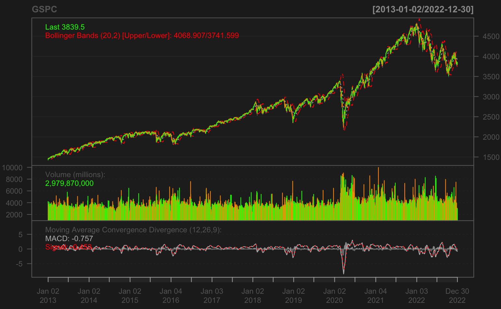

# Junior Data Analyst

Graduate of bachelor from Glion and MBA from FHGR with 8 years of solid working experience in different management roles in Swiss Hospitality Industry. Recently graduated from Master of Science in Applied Information and Data Science in HSLU Lucerne, I am willing to dive in at a granular level to mine and understand complex patterns, trends, and relations in data to surface hidden insight that can help and enable companies to make smarter business decisions and take appropriate actions to gain competitive advantages in the market.

## Education

### 2021-2023
**Master of Science in Applied Information and Data Science**  
Lucerne University of Applied Sciences and Arts

### 2019-2021
**Master in Tourism & Change**  
University of Applied Sciences of the Grisons

### 2010-2013
**BBA in Hospitality & Tourism**  
Glion Institute of Higher Education

### Technical Skills: Python, R Programming, SQL, Azure, Power BI, Tableau, Apache Hop

## Languages
- English
- Russian
- French
- Turkish

## Experience

### 2019 - 2023
**Hotel Bon Port, Vaud, Montreux, Switzerland**
Reservation Manager

### 2018 - 2019
**HSB Consultancy, Vaud, Lausanne, Switzerland**
Marketing Manager

### 2015 - 2017
**Hôtel Parc et lac, Vaud, Montreux, Switzerland**
Hotel Director Assistant

### 2013 - 2015
**Chalet Royalp Hotel&Spa,Vaud,Villars-sur-Ollon, Switzerland**
Concierge and Front Desk Agent

## Projects

**LAPD Crime Data Analysis Project with MongoDB**
  [project link](https://github.com/bahramkhanlarov/LAPD-Crime-Data-Analysis-Project-with-MongoDB)

- This project provides an in-depth analysis of crime data in the City of Los Angeles from 2020 onwards, using data sourced from the LAPD API. By using MongoDB we identified patterns, trends, and insights that could be valuable for various stakeholders, including law enforcement, tourism agencies, and the general public.

**S&P500 Stock Index Visual Analysis and Prediction**
  [project link](https://github.com/bahramkhanlarov/SP500-Stock-Index-Visual-Analysis-and-Prediction)

- By using R statistical programming, we presented a comprehensive visual analysis and prediction of the S&P 500 stock index, representing the performance of 500 large-cap publicly traded US companies. The analysis starts with a visual exploration using the MACD indicator. Advanced predictive models, including ARIMA, Prophet, and KNN, were applied to forecast the stock index over a 30-day horizon.

**Web Scraping and Visualization of Rental Data in Geneva (Switzerland) with Python**
  [project link](https://github.com/bahramkhanlarov/Homegate.ch-scraping-and-data-analysis-with-Pandas)

- Using Python scripts, the project demonstrates how to scrape apartment rental listings from the website homegate.ch, specifically for Geneva, Switzerland. After scraping, the data is converted into a Pandas dataframe. The repository also showcases the creation of Choropleth maps using the Altair package to visualize the rental data.

## Certifications

- Microsoft Azure Data Scientist Associate (DP100)
- Microsoft Power BI Data Analyst Associate (PL300)
- Microsoft Azure Data Fundamentals (DP900)
- Microsoft Security, Compliance, and Identity Fundamentals (SC900)
- DataCamp GitHub Concepts, Introduction to MongoDB, Building Recommendation System In Python
  
 ## Contact
 
**Phone:** +41 79 253 56 99  
**LinkedIn:** Bahram Khan  
**Email:** bahram.khanlarov@stud.hslu.ch  
**Address:** Avenue des Alpes 102, 1820 Montreux, Switzerland  

